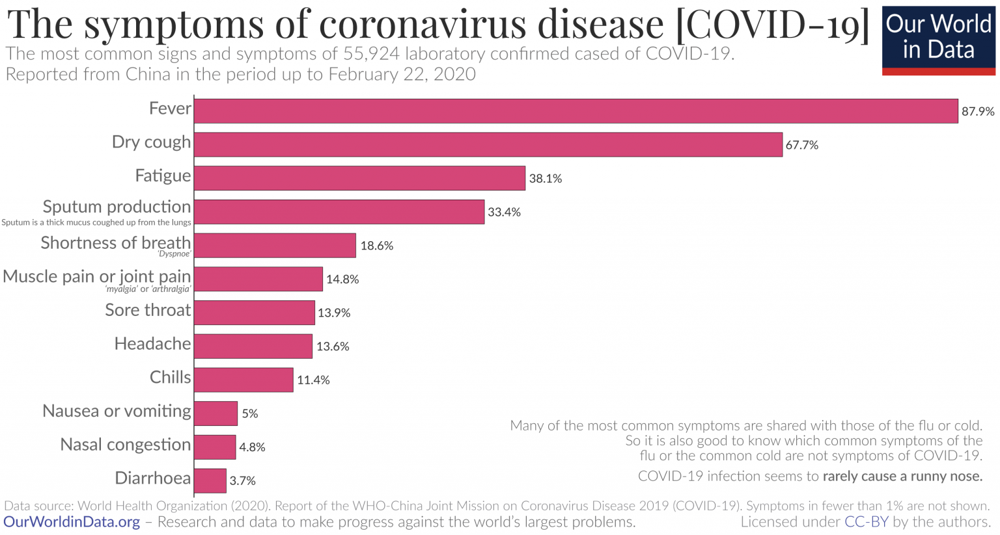

# Data Analysis Algorithm

Der Analyse Algorithmus hat das Ziel, die vom Nutzer eingegebenen Daten auszuwerten. Die Eingaben erfolgen über die Benutzeroberfläche. Erfasst werden dabei sowohl Symptome wie Fieber und Husten, als auch Angaben zu Alter, Wohnsituation, beruflichem Umfeld etc.

Das Ergebnis des Algorithmus ist eine Wahrscheinlichkeit, hier Disease Probability (DP) genannt, mit der der Nutzer, basierend auf seinen aktuellen Symptomen an COVID-19 erkrankt ist. Die Wahrscheilichkeiten basieren dabei auf Daten der WHO. Im  [Report of the WHO-China Joint Mission on Coronavirus Disease 2019 (COVID-19)] (https://www.who.int/docs/default-source/coronaviruse/who-china-joint-mission-on-covid-19-final-report.pdf) findet sich eine Auflistung der, im Zusammenhang mit der COVID-19 Lungenkrankheit, auftretenden Symptome und einer Wahrscheinlichkeit mit der sie bei Patienten beobachtet werden. 

Diese Werte dienen dem Analyse Algorithmus als wissenschaftlich fundierte Bemessungsgrundlage. 

Zusätzlich fließt eine Bewertung der Schwere des jeweiligen Symptoms mit in die Rechnung ein. Dazu hat der Nutzer die Möglichkeit einen Schieberegler seinem emfinden nach einzustellen. Das Minimum der Skala bedeutet ein Fehlen von Symptomen, das Maximum eine starke Ausprägung jener. Die zugrundeliegende Skala erlaubt dabei Eingabemöglichkeiten in einem Bereich zwischen 0-100. 

Eine Ausnahme stellt der Wert für Fieber da. Der mögliche Bereich zwischen 36,3 und 42,5 wird mithilfe von nichtlinear auf den Bereich zwischen 0 und 100 abgebildet. Die Transformation erfolgt dabei als Interpolation innerhalb der einzelnen Gruppen von verschiedenen Schweregraden von Fieber. [Fieber](https://www.netdoktor.at/krankheit/fieber-7557)

| Schwere                  | von   |  bis |
| :-----------------------:|:-----:| :---:|
| Normale Körpertemperatur | 36,3  | 37,4 |
| Erhöhte Temperatur       | 37,5  |  38  |
| Leichtes Fieber          | 38,1  | 38,5 |
| Mäßiges Fieber           | 38,6  |  39  |
| Hohes Fieber             | 39,1  | 39,9 |
| Sehr hohes Fieber        |  40   | 42,5 |

Um die Wahrscheinlichkeit mit denen ein Symptom bei einem Patienten auftritt auf unseren Algorithmus zu übertragen, werden die Werte gemittelt, um eine theoretische Gesamtwahrscheinlichkeit von 100% zu erreichen, für den Fall, dass der Nutzer alle Symptome aufweist.
Dazu wird zunächst die Gesamtsumme der Wahrscheinlichkeit aller betrachteten Symptome gebildet.

(87,9 + 67,7 + 38,1 + 18,6 + 14,8 + 13,9 + 13,6 + 11,4 + 5 + 4,8 + 3,7) * %  = 279,5 %

Nun wird die Wahrscheinlichkeit für jedes der Symptome (z. B. Fieber = 87,9 %) geteilt durch die Summe der Wahrscheinlichkeiten. 

Fieber:  87,9% / 2,795 = 31,44%
Husten: 67,7% / 2,795 = 24,22%
etc.

Darauf folgt die Berechnung der Wahrscheinlichkeit für jedes Symptom (Symptom Probability) unter Einbeziehung des Schweregrades der vom Nutzer angegeben wurde. 
Die Symptom Probability erfolgt durch Multiplikation von dem Schwerefaktor mit der gemittelten Wahrscheinlichkeit für jedes Symptom.

       Fieber = 38,8 * 31,44%              = 22,008 %

       Husten = 80% * 24,22%               = 19,376 %

       Abgeschlagenheit = 60% * 13,63%     = 8,178 %

       Kurzatmigkeit = 30% * 6,654         = 1,996 %

      Muskel-/Gelenkschm. = 40% * 5,295%   = 2,118 %

      Halsschmerz = 30% * 4,97%            = 1,491 %

      Kopfschmerz = 20% * 4,571%           = 0,9142 %

      Schüttelfrost = 70% * 4,078%         =  1,459 %

      Übelkeit = 0 %

      Verstopfte Nase = 40% * 1,71%        = 0,686 %

      Durchfall = 0 %                     __________

                                           57,6002 %

Disease Probability =   57,6002 %

#Threshold

Die Disease Probability (DP) bezeichnet zunächst die Wahrhscheinlichkeit mit der Ein Nutzer, bezogen auf die ANgaben zu seinen Symptomen, an COVID-19 erkrankt sein könnte. Um über die DEEPER-App eine Handlungsempfehlung auszusprechen, wird nun ein Schwellenwert festgelegt. Liegt die DP unter dem Schwellenwert, wird der Nutzer als nicht gefährdet eingestuft. Befindet sich die Person mit ihrer DP jedoch über dem Schwellenwert so wird sie als gefährdet eingestift und bekommt die Empfehlung ????????

Die Höhe des Schwellenwerts wird individuell für jeden Nutzer festgelegt. Sie orientiert sich dabei an seinem persönlichen Risikopotenzial, welches mithilfe verschiedener Fragen z. B. zu Alter, Wohnsituation und beruflichem Umfeld ermittelt wird.

Je nachdem was als Schwelle festgelegt wird, erfolgt anahand der Disease Probability eine Klassifizierung als Covid-19
